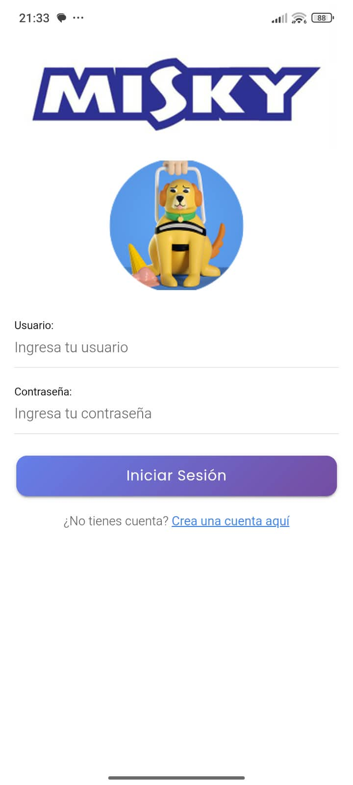
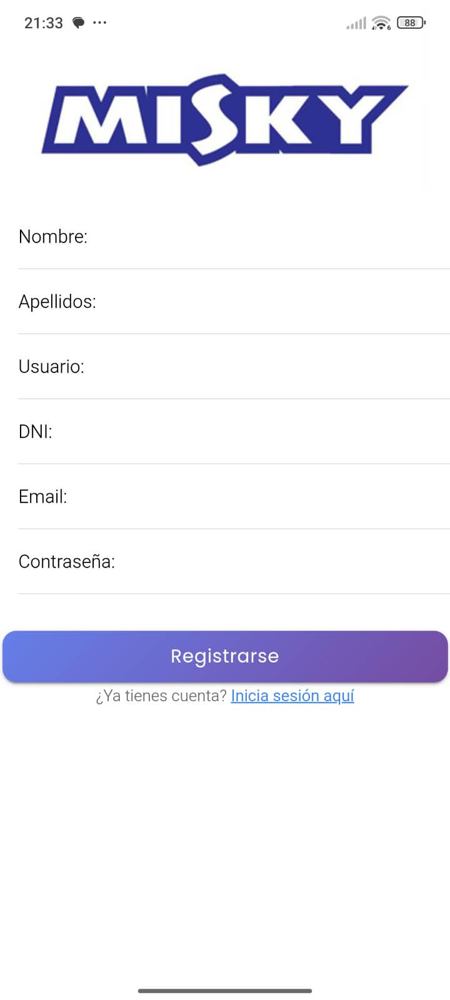
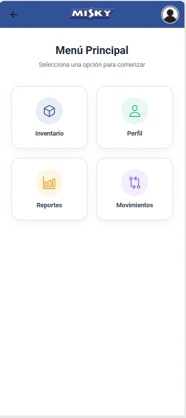
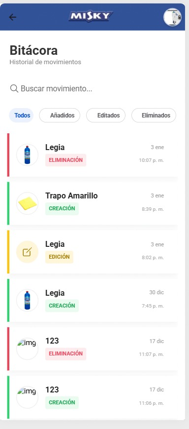
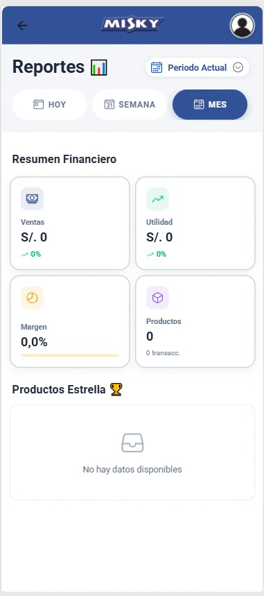
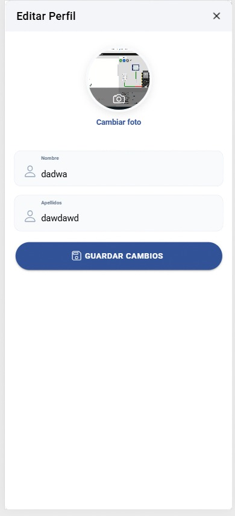

# Nombre de la Aplicación

Aplicación desarrollada en **Ionic** con **Angular**. Este proyecto es de uso libre; puedes modificarlo y adaptarlo según tus necesidades.

> **¡Atención!** Es obligatorio tener **Ionic CLI** instalado para que la aplicación funcione correctamente.

---

## 📱 Capturas de Pantalla

| Login | Registro | Menú |
| :---: | :---: | :---: |
|  |  |  |

| Movimientos | Reporte | Perfil |
| :---: | :---: | :---: |
|  |  |  |

---

## Prerrequisitos

Asegúrate de contar con las siguientes herramientas instaladas en tu sistema antes de continuar:
- **Node.js** y **NPM**
- **Angular CLI**
- **Ionic CLI** (Si no lo tienes, puedes instalarlo ejecutando `npm install -g @ionic/cli`)

---

## Ejecución del Proyecto

1. Clona o descarga este repositorio en tu computadora.
2. Abre una terminal en la carpeta del proyecto e instala las dependencias:
   npm install
3. Inicia el servidor de desarrollo ejecutando:
   ionic serve
